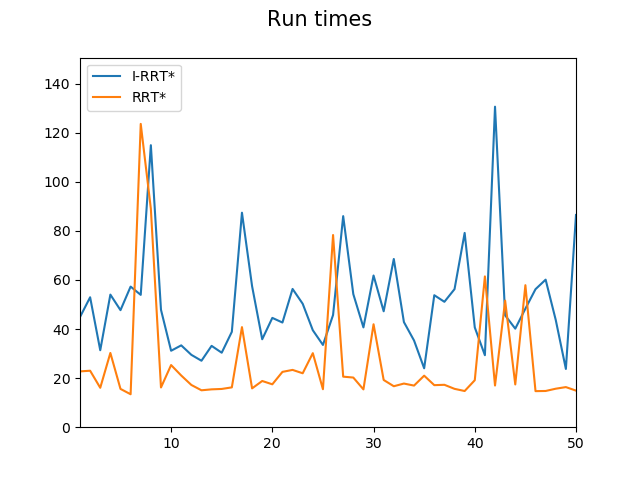

# A Comparative Study of Sampling-based Planners
## Introduction
This is a Python package which demonstrates the difference in performance between collision-checking algorithms in the sampling-based planning algorithm RRT.
## Setting up the package
```
git clone https://github.com/noble-platinate/Unsafe-Certificates-RRT.git
```
The config file can be used to switch and tune parameters such as step_size, search_radius, etc.
## Installing Dependencies
```
pip3 install -r requirements.txt
pip3 install opencv-python
```
## Running RRT
```
cd individual
python3 rrt.py
```
## Sample Results
<p float="left">
    
    
    
    
</p>
(left to right) RRT with normal collision checking, RRT with safety certificates, RRT with safety+unsafety certificates, RRT with safety certificates level 2

### Comparison Results
<p float="left">
    
</p>
Above are the results for a run on a randomly generated 1000x1000 obstacle map, step size = 12px, and search radius = 17px. 